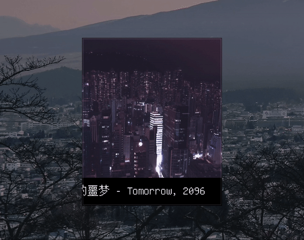

# micromusic
A tiny, lightweight miniplayer for Apple Music written in Rust with SDL2. Micromusic is minimalistic by design, with no text antialiasing or drop shadow, and just a few buttons. There's one line of text for the title, artist, and album, and it scrolls continuously. You can like/unlike, skip forward, skip backward, play/pause, and that's pretty much it. If that sounds fun to you, give it a try.

## Usage

This application has only been tested with Apple Music on MacOS Monterey. Since it uses AppleScript to get player data, it will not work with other operating systems or music software. It will likely work on other versions of MacOS, but there aren't any guarantees. 

Before compiling, you first need to install the SDL2 headers, for example with `brew install sdl2`.

